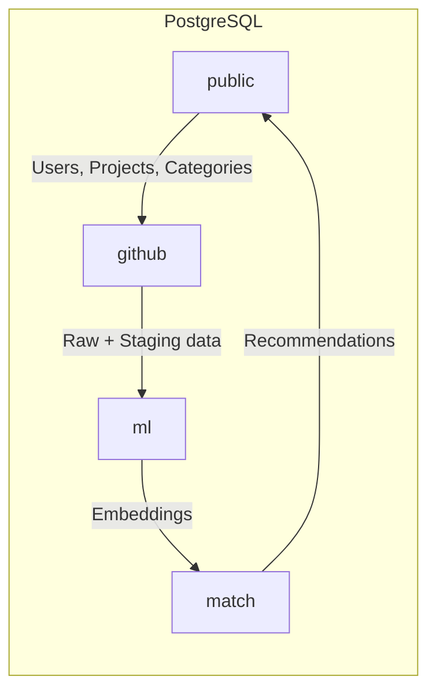

## Overview

OST Linker uses a single PostgreSQL database with the **pgvector** extension, organized into 4 schemas. The schema is defined in Prisma (`prisma/schema.prisma`) and serves as the single source of truth shared with the backend.



## Schemas

### `public` -- User-Facing Data

The primary schema used by the backend API. Contains all user-facing models.

| Table | Description |
|-------|-------------|
| `user` | User accounts with social links, GitHub/GitLab identities |
| `Project` | Published projects with metadata (title, description, URLs, trending flag) |
| `Category` | Project categories (e.g., Framework, Library, CLI Tool) |
| `Domain` | Project domains (e.g., Web Development, DevOps, Data Science) |
| `tech_stack` | Technologies and languages (typed as `TECH` or `LANGUAGE`) |
| `user_tech_stack` | Junction: user <-> tech stack preferences |
| `user_categories` | Junction: user <-> category preferences |
| `user_domain` | Junction: user <-> domain preferences |
| `project_tech_stack` | Junction: project <-> tech stacks |
| `project_category` | Junction: project <-> categories |
| `project_domain` | Junction: project <-> domains |
| `project_bookmark` | User bookmarks on projects |
| `match_global_recommendation` | Top-N global project recommendations (dbt-materialized) |
| `match_user_recommendation` | Per-user personalized recommendations (dbt-materialized) |

### `github` -- Raw and Staged Ingestion Data

All data scraped from GitHub lives here, from raw JSON through staged and enriched layers.

| Table | Managed By | Description |
|-------|-----------|-------------|
| `raw_github_project` | Go scraper | Raw JSON from GitHub Search API |
| `raw_github_readme` | Go fetcher | README content per project |
| `raw_github_languages` | Go fetcher | Language byte counts per project |
| `raw_github_topics` | Go fetcher | Topic arrays per project |
| `int_github_detection` | Python (FastText) | Language detection results and filtering |
| `stg_github__project` | dbt | Cleaned and typed project data |
| `stg_github__readme` | dbt | Staged README content |
| `stg_github__languages` | dbt | Staged language breakdowns |
| `stg_github__topics` | dbt | Staged topics |
| `stg_github__detection` | dbt | Staged detection metadata |
| `int_project_enriched` | dbt | Joined enriched project data |
| `fct_github_project` | dbt | Final fact table with stars, forks, pushed_at |

### `ml` -- Machine Learning Artifacts

Stores embeddings and intermediate ML data.

| Table | Managed By | Description |
|-------|-----------|-------------|
| `embd_github_project` | Python | 384-dim project embedding vectors |
| `embd_user` | Python | 384-dim user embedding vectors |
| `stg_public__project` | dbt | Project data staged for ML processing |
| `stg_public__user` | dbt | User data staged for ML processing |
| `int_user_enriched` | dbt | User context strings for embedding |
| `int_project_contextualized` | dbt | Project context strings for embedding |
| `int_project_embedding_candidate` | dbt | Projects ready for embedding |
| `fct_public_user` | dbt | Final user fact table |

### `match` -- Classification Results

| Table | Managed By | Description |
|-------|-----------|-------------|
| `project_classification` | Python (LLM) | Category and domain assignments with confidence scores |

## pgvector

The database uses the [pgvector](https://github.com/pgvector/pgvector) extension for vector similarity search.

| Property | Value |
|----------|-------|
| Extension | `vector` (enabled via Prisma) |
| Vector dimension | 384 (MiniLM-L6-v2 output) |
| Distance function | Cosine distance (`<=>` operator) |
| Similarity formula | `1 - (vector_a <=> vector_b)` |
| Similarity threshold | 0.25 (configurable via dbt var) |

<Info>
Cosine similarity is computed directly in SQL within dbt models. The `match_user_recommendation` model uses `1 - (uv.vector <=> pv.vector)` to score user-project pairs.
</Info>

The vector columns are defined in Prisma as `Unsupported("vector")` since Prisma does not natively support the pgvector type. The actual column type in PostgreSQL is `vector(384)`.

## Schema Routing in dbt

dbt models are routed to specific PostgreSQL schemas using the `generate_schema_name` macro. The target schema is set per model in `dbt_project.yml` via the `+schema` property:

```yaml
# Example from dbt_project.yml
models:
  ost_linker:
    staging:
      stg_github__project:
        +schema: github      # Writes to github.stg_github__project
      stg_public__user:
        +schema: ml           # Writes to ml.stg_public__user
    marts:
      match_global_recommendation:
        +schema: public       # Writes to public.match_global_recommendation
```

The custom `generate_schema_name` macro overrides dbt's default behavior to use the configured schema name directly, without prepending the target schema.

## Prisma as Schema Manager

Prisma manages the database schema for both the AI engine and the backend:

- **Schema definition:** `prisma/schema.prisma` declares all models across all 4 schemas
- **Extensions:** pgvector and uuid-ossp are enabled via `extensions = [uuidOssp, vector]`
- **Multi-schema support:** Uses `@@schema("public")`, `@@schema("github")`, `@@schema("ml")`, `@@schema("match")` annotations
- **Seed data:** `prisma/seed/seed.ts` populates Categories, Domains, and TechStacks
- **Cross-repo sync:** The Prisma schema is automatically synced to the backend repo via the `sync-prisma-backend.yml` GitHub Actions workflow
