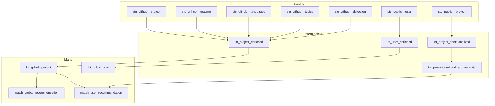

## Overview

The dbt project (`dbt/`) handles all SQL-based data transformations, from cleaning raw ingested data to computing recommendation scores. Models are organized into 3 layers: staging, intermediate, and marts.

All models are materialized as tables and routed to specific PostgreSQL schemas via the `generate_schema_name` macro.

## Model Organization



## Models Reference

### Staging Models

Staging models clean and type-cast raw data. They follow the `stg_<source>__<entity>` naming convention.

| Model | Schema | Dagster Group | Description |
|-------|--------|---------------|-------------|
| `stg_github__project` | `github` | ingestion | Flattens raw JSON from `raw_github_project` into typed columns (name, description, stars, URL, etc.) |
| `stg_github__readme` | `github` | ingestion | Stages README content from `raw_github_readme` |
| `stg_github__languages` | `github` | ingestion | Stages language breakdowns from `raw_github_languages` |
| `stg_github__topics` | `github` | ingestion | Stages topic arrays from `raw_github_topics` |
| `stg_github__detection` | `github` | ingestion | Stages FastText detection results from `int_github_detection` |
| `stg_public__project` | `ml` | project_ml | Stages public project data for ML processing |
| `stg_public__user` | `ml` | user_ml | Stages user data for ML processing |

### Intermediate Models

Intermediate models join, enrich, and prepare data for consumption.

| Model | Schema | Dagster Group | Description |
|-------|--------|---------------|-------------|
| `int_project_enriched` | `github` | ingestion | Joins project with readme, languages, topics, and detection data |
| `int_project_contextualized` | `ml` | project_ml | Builds rich context strings for embedding using `build_project_context` macro |
| `int_project_embedding_candidate` | `ml` | project_ml | Filters projects with valid context strings, ready for embedding |
| `int_user_enriched` | `ml` | user_ml | Builds user context strings for embedding using `build_user_context` macro |

### Mart Models

Mart models are the final consumption layer, used directly by the backend and ML assets.

| Model | Schema | Dagster Group | Description |
|-------|--------|---------------|-------------|
| `fct_github_project` | `github` | ingestion | Fact table with stars, forks, pushed_at, and all enriched metadata |
| `fct_public_user` | `ml` | user_ml | User fact table with aggregated preferences |
| `match_global_recommendation` | `public` | project_ml | Top-N global recommendations (trending/published, ordered by recency and stars) |
| `match_user_recommendation` | `public` | user_ml | Per-user personalized recommendations with hybrid scoring |

## Macros

### Data Cleaning

| Macro | Description |
|-------|-------------|
| `clean_text(column)` | Strips HTML, normalizes whitespace, removes special characters |
| `deduplicate(relation, partition_by, order_by)` | Window-function dedup (keeps first row per partition) |
| `jsonb_to_list(column)` | Converts a JSONB array to a comma-separated string |

### Context Building

| Macro | Description |
|-------|-------------|
| `build_project_context(...)` | Concatenates project title, description, topics, languages, and README into a single string for embedding |
| `build_user_context(...)` | Concatenates user bio, job title, tech stacks, categories, and domains into a single string for embedding |

### Scoring Helpers

| Macro | Description |
|-------|-------------|
| `safe_divide(numerator, denominator)` | Returns NULL instead of dividing by zero |
| `clamp(expression)` | Clamps a numeric expression to the [0, 1] range |

### Schema Management

| Macro | Description |
|-------|-------------|
| `generate_schema_name(custom_schema_name, node)` | Overrides dbt default to use the `+schema` value directly without prefix |

## Recommendation Scoring

### Global Recommendations

The `match_global_recommendation` model selects the top-N projects (default: 20) that are trending or published, ordered by last sync time and star count.

### User Recommendations (Hybrid Scoring)

The `match_user_recommendation` model computes personalized scores by blending 4 signals:

| Signal | Weight | Description |
|--------|--------|-------------|
| **Similarity** | 40% | Cosine similarity between user and project embeddings (`1 - (user_vec <=> proj_vec)`) |
| **Preference** | 35% | Weighted overlap between user and project attributes (tech stacks, categories, domains) |
| **Freshness** | 15% | Linear decay based on last push date (configurable decay window: 90 days) |
| **Popularity** | 10% | Log-normalized star count, scaled to [0, 1] |

The final formula:

```
final_score = 0.40 * similarity + 0.35 * preference + 0.15 * freshness + 0.10 * popularity
```

#### Preference Score Breakdown

The preference signal itself is a weighted combination of 3 overlap dimensions:

| Dimension | Sub-Weight | Calculation |
|-----------|-----------|-------------|
| Tech stacks | 30% | `shared_tech_stacks / user_total_tech_stacks` |
| Categories | 45% | `shared_categories / user_total_categories` |
| Domains | 25% | `shared_domains / user_total_domains` |

<Info>
If a user has no items in a dimension (e.g., no tech stacks selected), that dimension is excluded and its weight is redistributed proportionally among active dimensions. This prevents penalizing users with incomplete profiles.
</Info>

#### Filtering and Thresholds

| Parameter | Default | Description |
|-----------|---------|-------------|
| `similarity_threshold` | 0.25 | Minimum cosine similarity to be considered |
| `reco_top_n` | 30 | Maximum recommendations per user |
| `freshness_decay_days` | 90 | Days until freshness score reaches 0 |
| `global_reco_top_n` | 20 | Number of global recommendations |

All scoring parameters are defined as dbt vars in `dbt_project.yml` and can be overridden at runtime.

## Data Contracts

Mart models use dbt data contracts with `contract: {enforced: true}`. Each column specifies a `data_type` and optional `constraints`, ensuring schema stability for downstream consumers (backend API, ML assets).

## Profiles

| Profile | Host | Port | Usage |
|---------|------|------|-------|
| `local` (default) | `localhost` | 5433 | Local development (DB exposed via Docker) |
| `docker` | `db` | 5432 | Inside Docker Compose network |

Switch profiles by setting the `DBT_TARGET` environment variable:

```bash
export DBT_TARGET=docker
dbt build
```
