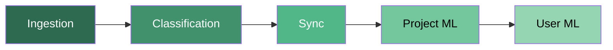
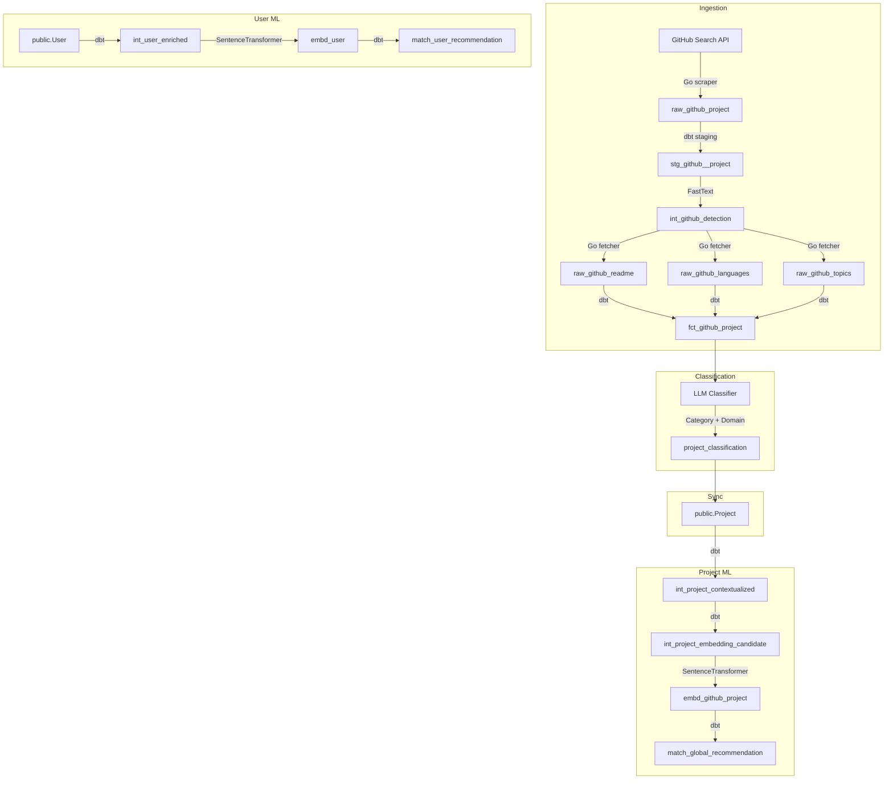

## What is OST Linker?

OST Linker is the AI-powered recommendation engine behind [OpenSourceTogether](https://opensource-together.com/). It continuously scrapes GitHub for open-source projects, classifies them using LLMs, computes semantic embeddings, and surfaces personalized recommendations to users via cosine similarity with pgvector.

<Info>
OST Linker runs as a fully automated pipeline orchestrated by **Dagster**. Once deployed, it requires no manual intervention -- projects are discovered, enriched, classified, and recommended on schedule.
</Info>

## Data Flow

The pipeline follows a linear progression through 5 stages:

### Detailed Pipeline

## Pipeline Stages

| Stage | Purpose | Key Technology |
|-------|---------|----------------|
| **Ingestion** | Scrape GitHub, detect languages, fetch READMEs/topics/languages | Go binaries, FastText, dbt |
| **Classification** | Assign Category and Domain to each project via LLM | Mistral Small 3.2 via OpenRouter |
| **Sync** | Write enriched project data to the public-facing `Project` table | Python, PostgreSQL |
| **Project ML** | Build project context strings, compute 384-dim embeddings, generate global recommendations | dbt, SentenceTransformer (MiniLM-L6-v2) |
| **User ML** | Build user context strings, compute user embeddings, generate personalized recommendations | dbt, SentenceTransformer, pgvector cosine similarity |

## Tech Stack

| Layer | Technology |
|-------|-----------|
| **Orchestration** | Dagster (assets, jobs, schedules, sensors) |
| **Data transformation** | dbt (staging, intermediate, marts) |
| **Ingestion services** | Go 1.24 (scraper + fetcher binaries) |
| **ML / Classification** | Python 3.11, SentenceTransformer, FastText, OpenRouter (Mistral) |
| **Database** | PostgreSQL + pgvector (384-dim vectors, cosine similarity) |
| **Schema management** | Prisma (4 schemas: `public`, `github`, `ml`, `match`) |
| **Containerization** | Docker (3-stage build: Go builder, Python builder, runtime) |
| **CI/CD** | GitHub Actions (quality checks, Docker publish, submodule sync) |

## Key Design Decisions

1. **Go for ingestion** -- High-performance concurrent HTTP requests with goroutines and rate limiting, compiled to static binaries invoked by Dagster via `subprocess.run()`
2. **dbt for transformations** -- SQL-first data modeling with contracts, tests, and documentation baked in
3. **Hybrid recommendation scoring** -- Combines semantic similarity (40%), user preference overlap (35%), project freshness (15%), and popularity (10%)
4. **pgvector for similarity search** -- Native PostgreSQL extension for cosine similarity on 384-dimensional embeddings, no external vector DB required
5. **Prisma as schema source of truth** -- Single schema definition shared between the backend (Node.js) and the AI engine

## Getting Started

<CardGroup cols={2}>
  <Card title="Pipeline Deep-Dive" icon="diagram-project" href="/ai/pipeline">
    Understand every asset, job, and schedule in detail
  </Card>
  <Card title="Installation" icon="wrench" href="/ai/installation">
    Set up the development environment from scratch
  </Card>
  <Card title="Database Schema" icon="database" href="/ai/database">
    Explore the 4 PostgreSQL schemas and pgvector setup
  </Card>
  <Card title="Project Structure" icon="folder-tree" href="/ai/structure">
    Navigate the codebase directory layout
  </Card>
</CardGroup>
