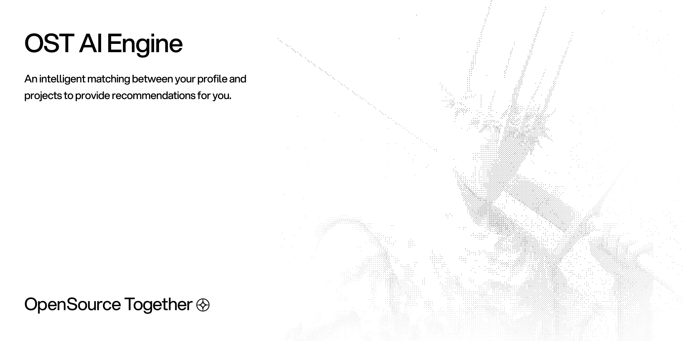

Learn about the OST AI-Engine architecture and features

## Introduction

The AI-Engine is a modular, extensible data & machine learning platform designed to orchestrate, analyze, and enrich open-source project data. 
Its mission is to automate the collection, transformation, and ranking of data from sources like GitHub and GitLab, powering advanced analytics and dashboards for the [OpenSource Together](https://opensource-together.com) ecosystem.

<Info>
	<b>Core Principle:</b> The AI Engine centralizes data intelligence for open-source communities, enabling automated workflows, unified data models, and scalable enrichment pipelines.
</Info>

## Key Features

<CardGroup cols={2}>
	<Card title="Automated Scraping" icon="robot" href="/ai/pipeline">
		Collects and updates project data from GitHub & GitLab sources automatically
	</Card>
	<Card title="Data Mapping" icon="shuffle" href="/ai/structure">
		Transforms raw data into a unified, queryable format for analytics and dashboards
	</Card>
	<Card title="Ranking & Filtering" icon="star" href="/ai/pipeline">
		Ranks projects by popularity, activity, and custom metrics
	</Card>
	<Card title="Prisma Integration" icon="database" href="/ai/installation">
		Seamless integration with a PostgreSQL database using Prisma ORM
	</Card>
	<Card title="Dagster Orchestration" icon="repeat" href="/ai/pipeline">
		Robust pipeline orchestration, scheduling, and asset checks with Dagster
	</Card>
	<Card title="Installation & Setup" icon="wrench" href="/ai/installation">
		Step-by-step guide to install dependencies, configure environment, and deploy the AI Engine
	</Card>
</CardGroup>

## Technology Stack

<AccordionGroup>
	<Accordion title="Orchestration & Pipelines">
		- <b>Dagster</b>: Data pipeline orchestration, scheduling, and asset management
	</Accordion>
	<Accordion title="Database & ORM">
		- <b>Prisma</b>: Type-safe ORM for PostgreSQL
		- <b>PostgreSQL</b>: Scalable relational database
	</Accordion>
    <Accordion title="Programming Language">
        - <b>Python 3.13+</b>: Core engine and pipeline logic
        - <b>Go 1.20+</b>: Ingestion services and high-performance modules
    </Accordion>
	<Accordion title="DevOps & Integration">
		- <b>Docker</b>: Containerized deployment
		- <b>GitHub Actions</b>: CI/CD workflows
	</Accordion>
</AccordionGroup>

## Architecture Principles

The AI Engine follows a <b>feature-based architecture</b> with clear separation of concerns:

<Info>
	<b>Extensibility:</b> Easily add new data sources, assets, and custom logic via modular connectors and pipelines.
</Info>

### Key Architectural Decisions

1. <b>Modular Connectors:</b> Each data source (GitHub, GitLab, etc.) is handled by an autonomous connector module
2. <b>Unified Data Model:</b> All raw data is mapped to a consistent schema for analytics and dashboards
3. <b>Automated Pipelines:</b> Dagster orchestrates scraping, transformation, and enrichment workflows
4. <b>Type Safety & Reliability:</b> Prisma ensures robust database operations and schema validation
5. <b>Scalability:</b> Designed to handle thousands of projects and contributors

## Getting Started

Ready to build with the AI Engine? Follow our <a href="/ai/quickstart">Quick Start Guide</a> to set up your development environment.

<CardGroup cols={2}>
	<Card title="Quick Start" icon="rocket" href="/ai/quickstart">
		Get up and running in minutes
	</Card>
	<Card title="Architecture Guide" icon="sitemap" href="/ai/structure">
		Deep dive into the AI Engine architecture
	</Card>
</CardGroup>
