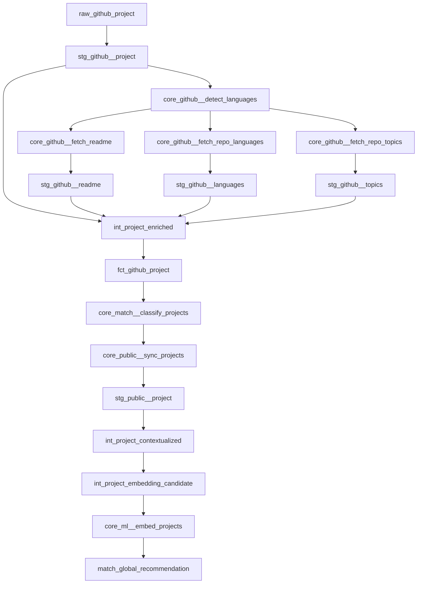

## Asset Groups

OST Linker organizes its Dagster assets into 5 groups that execute in sequence. Each group contains both Python assets and dbt models.

### Ingestion

The ingestion group collects raw data from GitHub and transforms it through staging and enrichment layers.

| Asset | Type | Description |
|-------|------|-------------|
| `raw_github__extract_projects` | Python (Go subprocess) | Runs the Go scraper to search GitHub and upsert raw project data |
| `stg_github__project` | dbt | Cleans and flattens raw JSON into typed columns |
| `core_github__detect_languages` | Python | Filters non-English repos using FastText language detection |
| `core_github__fetch_readme` | Python (Go subprocess) | Fetches README content for detected projects |
| `core_github__fetch_repo_languages` | Python (Go subprocess) | Fetches repository language breakdowns |
| `core_github__fetch_repo_topics` | Python (Go subprocess) | Fetches repository topics |
| `stg_github__readme`, `stg_github__languages`, `stg_github__topics`, `stg_github__detection` | dbt | Staging models for fetched data |
| `int_project_enriched` | dbt | Joins all staging sources into a single enriched project view |
| `fct_github_project` | dbt | Final fact table with stars, forks, pushed_at, and all metadata |

### Classification

| Asset | Type | Description |
|-------|------|-------------|
| `core_match__classify_projects` | Python | Sends project context to Mistral Small 3.2 (via OpenRouter) to assign a Category and Domain |

The LLM receives a truncated context (max 8,000 chars) containing the project title, description, topics, and README. It returns a JSON object with `category` and `domain` fields matched against the valid labels from the database.

### Sync

| Asset | Type | Description |
|-------|------|-------------|
| `core_public__sync_projects` | Python | Syncs enriched and classified project data into the `public.Project` table |

### Project ML

| Asset | Type | Description |
|-------|------|-------------|
| `stg_public__project` | dbt | Stages public project data for ML processing |
| `int_project_contextualized` | dbt | Builds rich context strings from project metadata using the `build_project_context` macro |
| `int_project_embedding_candidate` | dbt | Selects projects ready for embedding (non-null context) |
| `core_ml__embed_projects` | Python | Computes 384-dim embeddings with SentenceTransformer and upserts to `ml.embd_github_project` |
| `match_global_recommendation` | dbt | Top-N global recommendations ranked by recency and stars |

### User ML

| Asset | Type | Description |
|-------|------|-------------|
| `stg_public__user` | dbt | Stages user data for ML processing |
| `int_user_enriched` | dbt | Builds user context strings using the `build_user_context` macro |
| `fct_public_user` | dbt | Final user fact table |
| `core_ml__embed_users` | Python | Computes 384-dim user embeddings and upserts to `ml.embd_user` |
| `match_user_recommendation` | dbt | Personalized recommendations using hybrid scoring |

## Data Flow

The full asset dependency graph follows this order:

## Jobs

| Job | Groups | Description | Retry Policy |
|-----|--------|-------------|-------------|
| `project_enrichment_job` | ingestion, classification, sync, project_ml | Full project pipeline from scraping to recommendations | 2 retries, exponential backoff, full jitter |
| `user_recommendation_job` | user_ml | User embedding and recommendation refresh | Default |
| `run_all_job` | All groups | Manual-only job for initial setup or recovery | Default |
| `cleanup_dagster_history_job` | N/A | Cleans up old Dagster run history | Default |

<Info>
The `project_enrichment_job` is tagged with `dagster/max_concurrent_runs: 1` to prevent overlapping runs.
</Info>

## Schedules

| Schedule | Job | Cron | Timezone | Status |
|----------|-----|------|----------|--------|
| `project_enrichment_schedule` | `project_enrichment_job` | `0 3 * * *` (daily at 3 AM) | Europe/Paris | Running |
| `user_recommendation_schedule` | `user_recommendation_job` | `*/10 * * * *` (every 10 min) | Europe/Paris | Running |
| `cleanup_dagster_history_schedule` | `cleanup_dagster_history_job` | `0 23 */2 * *` (every 2 days at 11 PM) | Europe/Paris | Running |

## Resources

All resources are configured in `src/linker/definitions.py` and injected into assets via `required_resource_keys`.

### PipelineConfig

Central configuration resource that reads environment variables at runtime.

| Field | Source | Description |
|-------|--------|-------------|
| `db_url` | `DATABASE_URL` | PostgreSQL connection string |
| `github_token` | `GITHUB_ACCESS_TOKEN` | GitHub API token for scraping |
| `go_scraper_path` | `GO_SCRAPER_PATH` | Path to compiled Go scraper binary |
| `go_fetcher_path` | `GO_FETCHER_PATH` | Path to compiled Go fetcher binary |
| `github_api_url` | Hardcoded | `https://api.github.com/search/repositories` |

The config resource also builds GitHub search queries dynamically. Queries target 3 star ranges (300-1000, 1000-3000, 3000-5000) with filters for good first issues, recent activity, and excluded terms (awesome, roadmap, cheatsheet, interview).

### LLMClassifierResource

| Property | Value |
|----------|-------|
| Provider | OpenRouter (`https://openrouter.ai/api/v1`) |
| Model | `mistralai/mistral-small-3.2-24b-instruct` |
| Temperature | 0.0 |
| Response format | JSON object |
| Timeout | 45s hard timeout (thread-based) |
| Context truncation | 8,000 characters |

### SentenceTransformerResource

| Property | Value |
|----------|-------|
| Model | `sentence-transformers/all-MiniLM-L6-v2` |
| Embedding dimension | 384 |
| Device | CPU (configurable) |
| Normalization | Enabled (for cosine similarity) |

Supports both single text encoding (`encode`) and batch encoding (`encode_batch`).

### FastTextModelResource

| Property | Value |
|----------|-------|
| Model file | `models/lid.176.ftz` |
| Purpose | Language detection on project text (name, description, README) |
| Loading | Lazy-loaded singleton, reused across all runs |

### PandasPostgresIOManager

Custom IO manager that transfers DataFrames between assets via PostgreSQL. Uses a schema/table allowlist to prevent SQL injection. Supports truncate-then-append writes and full table reads.

### Other Resources

| Resource | Type | Purpose |
|----------|------|---------|
| `dbt` | `DbtCliResource` | Runs dbt CLI commands from Dagster |
| `fs_io_manager` | `FilesystemIOManager` | Default file-based IO for non-DB assets |
